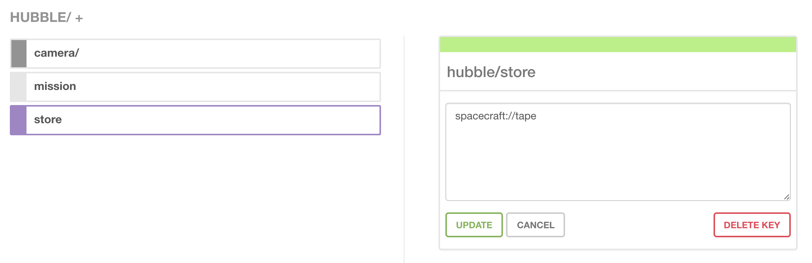
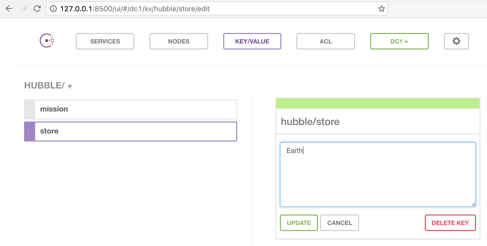
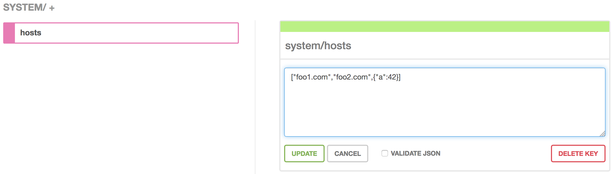

## Diplomatic rank

_[source](https://en.wikipedia.org/wiki/Diplomatic_rank#Historical_ranks.2C_1815-1961):_

> _The rank of Envoy was short for "Envoy Extraordinary and Minister Plenipotentiary", and was more commonly known as Minister. For example, the Envoy Extraordinary and Minister Plenipotentiary of the United States to the French Empire was known as the "United States Minister to France" and addressed as "Monsieur le Ministre."_

<hr/>

[](http://clojars.org/tolitius/envoy)

- [How to play](#how-to-play)
- [Map to Consul](#map-to-consul)
- [Consul to Map](#consul-to-map)
  - [Reading with an offset](#reading-with-an-offset)
- [Watch for key/value changes](#watch-for-keyvalue-changes)
  - [Watch nested keys](#watch-nested-keys)
  - [Watching the Watcher](#watching-the-watcher)
- [Consul CRUD](#consul-crud)
  - [Adding to Consul](#adding-to-consul)
  - [Reading from Consul](#reading-from-consul)
  - [Deleting from Consul](#deleting-from-consul)
- [Clone and Teleport](#clone-and-teleport)
  - [Copy](#copy)
  - [Move](#move)
- [Merging Configurations](#merging-configurations)
- [Options](#options)
  - [Serializer](#serializer)
- [License](#license)

## How to play

In order to follow all the docs below, bring envoy in:

```clojure
$ boot repl
boot.user=> (require '[envoy.core :as envoy :refer [stop]])
nil
```

## Map to Consul

Since most Clojure configs are EDN maps, you can simply push the map to Consul with preserving the hierarchy:

```clojure
boot.user=> (def m {:hubble
                    {:store "spacecraft://tape"
                     :camera
                      {:mode "color"}
                     :mission
                      {:target "Horsehead Nebula"}}})

boot.user=> (envoy/map->consul "http://localhost:8500/v1/kv" m)
nil
```

done.

you should see Consul logs confirming it happened:

```bash
2016/11/02 02:04:13 [DEBUG] http: Request PUT /v1/kv/hubble/mission/target? (337.69µs) from=127.0.0.1:39372
2016/11/02 02:04:13 [DEBUG] http: Request GET /v1/kv/hubble?recurse&index=2114 (4m41.723665304s) from=127.0.0.1:39366
2016/11/02 02:04:13 [DEBUG] http: Request PUT /v1/kv/hubble/camera/mode? (373.246µs) from=127.0.0.1:39372
2016/11/02 02:04:13 [DEBUG] http: Request PUT /v1/kv/hubble/store? (1.607247ms) from=127.0.0.1:39372
```

and a visual:

<p align="center"></p>

## Consul to Map

In case a Clojure map with config read from Consul is needed it is just `consul->map` away:

```clojure
boot.user=> (envoy/consul->map "http://localhost:8500/v1/kv/hubble")
{:hubble
 {:camera {:mode "color"},
  :mission {:target "Horsehead Nebula"},
  :store "spacecraft://tape"}}
```

you may notice it comes directly from "the source" by looking at Consul logs:

```bash
2016/11/02 02:04:32 [DEBUG] http: Request GET /v1/kv/hubble?recurse (76.386µs) from=127.0.0.1:54167
```

### Reading with an offset

You may also read from consul at a certain `:offset` by specifying it in options.

Let's say we need to get everything that lives under the `hubble/mission`:

```clojure
boot.user=> (envoy/consul->map "http://dev-server:8500/v1/kv" {:offset "hubble/mission"})
{:target "Horsehead Nebula"}
```

Specifying an offset is really useful for multiple environments or teams living in the same consul / acl.

## Watch for key/value changes

Watching for kv changes with envoy _does not require_ to run a separate Consul Agent client or Consul Template and boils down to a simple function:

```clojure
(watch-path path fun)
```

`fun` is going to be called with a new value each time the `path`'s value is changed.

```clojure
boot.user=> (def store-watcher (envoy/watch-path "http://localhost:8500/v1/kv/hubble/store"
                                                 #(println "watcher says:" %)))
```

creates a `envoy.core.Watcher` and echos back the current value:

```clojure
#'boot.user/store-watcher
watcher says: {:hubble/store spacecraft}
```

it is an `envoy.core.Watcher`:

```clojure
boot.user=> store-watcher
#object[envoy.core.Watcher 0x72a190f0 "envoy.core.Watcher@72a190f0"]
```

that would print to REPL, since that's the function provided `#(println "watcher says:" %)`, every time the key `hubble/store` changes.

let's change it to "Earth":
<p align="center"></p>

once the "UPDATE" button is clicked REPL will notify us with a new value:

```clojure
watcher says: {:hubble/store Earth}
```

same thing if it's changed with `envoy/put`:

```clojure
boot.user=> (envoy/put "http://localhost:8500/v1/kv/hubble/store" "spacecraft tape")
watcher says: {:hubble/store spacecraft tape}
{:opts {:body "spacecraft tape", :method :put, :url "http://localhost:8500/v1/kv/hubble/store"}, :body "true", :headers {:content-length "4", :content-type "application/json", :date "Wed, 02 Nov 2016 03:22:41 GMT"}, :status 200}
```

`envoy.core.Watcher` is stoppable:

```clojure
boot.user=> (stop store-watcher)
"stopping" "http://localhost:8500/v1/kv/hubble/store" "watcher"
true
```

### Watch Nested Keys

In case you need to watch a hierarchy of keys (with all the nested keys), you can set a watcher on a local root key:

```clojure
boot.user=> (def hw (envoy/watch-path "http://localhost:8500/v1/kv/hubble"
                                      #(println "watcher says:" %)))
```

notice this watcher is on the top most / root `/hubble` key.

In this case _only the nested keys which values are changed_ will trigger notifications.

Let's say we went to `hubble/mission` and changed it from "Horsehead Nebula" to "Butterfly Nebula":

```clojure
watcher says: {:hubble/mission Butterfly Nebula}
```

It can be stopped as any other watcher:

```clojure
boot.user=> (stop hw)
"stopping" "http://localhost:8500/v1/kv/hubble?recurse" "watcher"
true
```

### Watching the Watcher

There is a [more visual example](https://github.com/tolitius/hubble) of envoy watchers that propagate notifications all the way to the browser:


Notification listner is just a function really, hence it can get propagated anywhere intergalactic computer system can reach.

## Consul CRUD

### Adding to Consul

The map from above can be done manually by "puts" of course:

```clojure
boot.user=> (envoy/put "http://localhost:8500/v1/kv/hubble/mission" "Horsehead Nebula")
{:opts {:body "Horsehead Nebula", :method :put, :url "http://localhost:8500/v1/kv/hubble/mission"}, :body "true", :headers {:content-length "4", :content-type "application/json", :date "Wed, 02 Nov 2016 02:57:40 GMT"}, :status 200}

boot.user=> (envoy/put "http://localhost:8500/v1/kv/hubble/store" "spacecraft")
{:opts {:body "spacecraft", :method :put, :url "http://localhost:8500/v1/kv/hubble/store"}, :body "true", :headers {:content-length "4", :content-type "application/json", :date "Wed, 02 Nov 2016 02:58:13 GMT"}, :status 200}

boot.user=> (envoy/put "http://localhost:8500/v1/kv/hubble/camera/mode" "color")
{:opts {:body "color", :method :put, :url "http://localhost:8500/v1/kv/hubble/camera/mode"}, :body "true", :headers {:content-length "4", :content-type "application/json", :date "Wed, 02 Nov 2016 02:58:36 GMT"}, :status 200}
```

### Reading from Consul

```clojure
boot.user=> (envoy/get-all "http://localhost:8500/v1/kv/hubble")
{:hubble/camera/mode "color",
 :hubble/mission "Horsehead Nebula",
 :hubble/store "spacecraft://tape"}

boot.user=> (envoy/get-all "http://localhost:8500/v1/kv/hubble/store")
{:hubble/store "spacecraft"}
```

in case there is no need to convert keys to keywords, it can be disabled:

```clojure
boot.user=> (envoy/get-all "http://localhost:8500/v1/kv/" {:keywordize? false})
{"hubble/camera/mode" "color",
 "hubble/mission" "Horsehead Nebula",
 "hubble/store" "spacecraft://tape"}
```

### Deleting from Consul

```clojure
boot.user=> (envoy/delete "http://localhost:8500/v1/kv/hubble/camera")
{:opts {:method :delete, :url "http://localhost:8500/v1/kv/hubble/camera?recurse"}, :body "true", :headers {:content-length "4", :content-type "application/json", :date "Wed, 02 Nov 2016 02:59:26 GMT"}, :status 200}

boot.user=> (envoy/get-all "http://localhost:8500/v1/kv/hubble")
{:hubble/mission "Horsehead Nebula", :hubble/store "spacecraft://tape"}
```

## Clone and Teleport

It is often the case when configuration trees need to be copied or moved from one place to another, under a new root or a new nested path. `envoy` can do it with `copy` and `move` commands.

### Copy

Copying configuration from one place to another is done with a `copy` command:

> => _```(envoy/copy kv-path from to)```_

Let's say we need to copy Hubble's mission (i.e. a "sub" config) under a new root "dev", so it lives under "/dev/hubble/mission" instead:

```clojure
boot.user=> (envoy/copy "http://localhost:8500/v1/kv" "/hubble/mission" "/dev/hubble/mission")
```

done. Let's read from this new "dev" root to make sure the mission is there:

```clojure
boot.user=> (envoy/consul->map "http://localhost:8500/v1/kv/dev")
{:dev {:hubble {:mission {:target "Horsehead Foo"}}}}
```

great.

We can of course copy the whole "hubble"'s config under "dev":

```clojure
boot.user=> (envoy/copy "http://localhost:8500/v1/kv" "/hubble" "/dev/hubble")
```

```clojure
boot.user=> (envoy/consul->map "http://localhost:8500/v1/kv/dev")
{:dev {:hubble {:camera {:mode "color"}, :mission {:target "Horsehead Nebula"}, :store "spacecraft tape"}}}
```

`copy` is really handy when you need to copy configurations between environments, or just need to copy some nested portion of the config.

### Move

A `move` command is exactly the same as the `copy`, but, as you would expect, it deletes the source after the copy is done.

> => _```(envoy/move kv-path from to)```_

The Hubble's development work is finished, and we are switching to work on the Kepler telescope. Let's say most of the configuration may be reused, so we'll just move Hubble's config to Kepler:

```clojure
boot.user=> (envoy/move "http://localhost:8500/v1/kv" "/hubble" "/kepler")
```

done.

Oh, but we'll need "dev" and "qa" environments for Kepler's development. Let's move it again to live under "dev" root:

```clojure
boot.user=> (envoy/move "http://localhost:8500/v1/kv" "/kepler" "/dev/kepler")
```

and "copy" this config to "qa" before editing it:

```clojure
boot.user=> (envoy/copy "http://localhost:8500/v1/kv" "/dev/kepler" "/qa/kepler")
```

Let's look at Kepler's Consul universe:

```clojure
boot.user=> (envoy/consul->map "http://localhost:8500/v1/kv")

{:dev
 {:kepler
  {:mission {:target "Horsehead Nebula"},
   :camera {:mode "color"},
   :store "spacecraft tape"}},
 :qa
 {:kepler
  {:mission {:target "Horsehead Nebula"},
   :camera {:mode "color"},
   :store "spacecraft tape"}}}
```

Niice, universe awaits...

## Merging Configurations

Often there is an internal configuration some parts of which need to be overridden with values from Consul. Envoy has `merge-with-consul` function that does just that:

```clojure
(envoy/merge-with-consul config "http://localhost:8500/v1/kv/hubble")
```

will deep merge (with nested kvs) config with a map it'll read from Consul.

In case a Consul space is protected by a token, or any other options need to be passed to Consul to read the overrides, they can be added in an optional map:

```clojure
(envoy/merge-with-consul config
                         "http://localhost:8500/v1/kv/hubble"
                         {:token "7a0f3b39-8871-e16e-2101-c1b30a911883"})
```

## Options

All commands take an optional map of options.

For example, in case keys are protected by ACL, you can provide a token:

```clojure
boot.user=> (envoy/consul->map "http://localhost:8500/v1/kv"
                               {:token "4c308bb2-16a3-4061-b678-357de559624a"})
{:hubble {:mission "Butterfly Nebula", :store "spacecraft://ssd"}}
```

or any other Consul options.

### Serializer

By default envoy will serialize and deserialize data in EDN format. Which usually is quite transparent, since EDN map gets written and read from Consul as a nested key value structure which is just that: a map.

There are cases where values are sequences: i.e. `{:hosts ["foo1.com", "foo2.com"]}` in which case they will still be serialized and deserialized as EDN by default, however it might be harder to consume these EDN sequences from languages other than Clojure which do not speak EDN natively.

While there are libraries for other languages that support EDN

* Java: https://github.com/danboykis/trava
* Go: https://github.com/go-edn/edn
* Ruby: https://github.com/relevance/edn-ruby
* Python: https://github.com/swaroopch/edn_format
* etc.

envoy would allow to specify other serializers via a `:serializer` option:

```clojure
boot.user=> (def config {:system {:hosts ["foo1.com", "foo2.com", {:a 42}]}})
#'boot.user/config

boot.user=> (envoy/map->consul "http://dev-server:8500/v1/kv" config {:serializer :json})
nil

boot.user=> (envoy/consul->map "http://dev-server:8500/v1/kv/system" {:serializer :json})
{:system {:hosts ["foo1.com" "foo2.com" {:a 42}]}}
```

If `{:serializer :json}` option is provided sequence values will be stored in Consul as JSON:

<p align="center"></p>

which can be consumed from other languages without the need to know about EDN.

## License

Copyright © 2016 tolitius

Distributed under the Eclipse Public License either version 1.0 or (at
your option) any later version.
